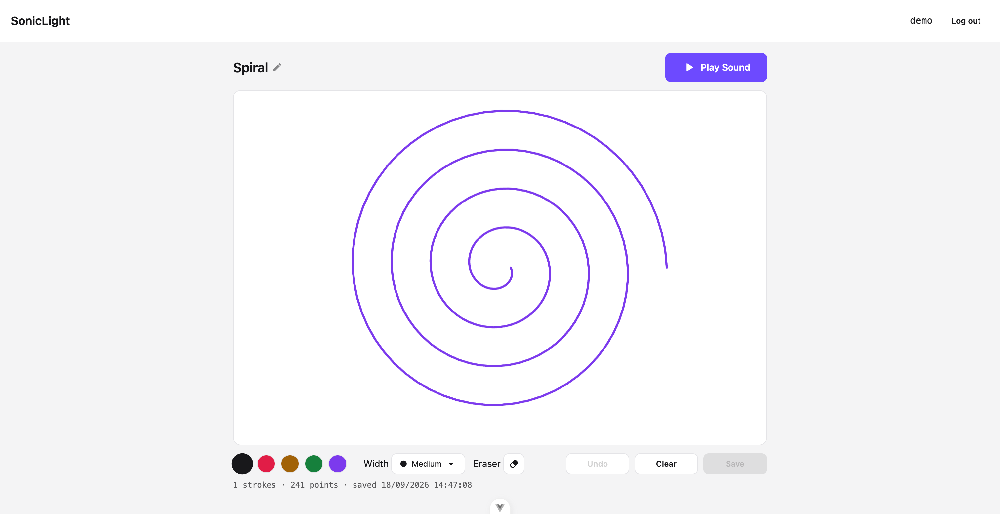
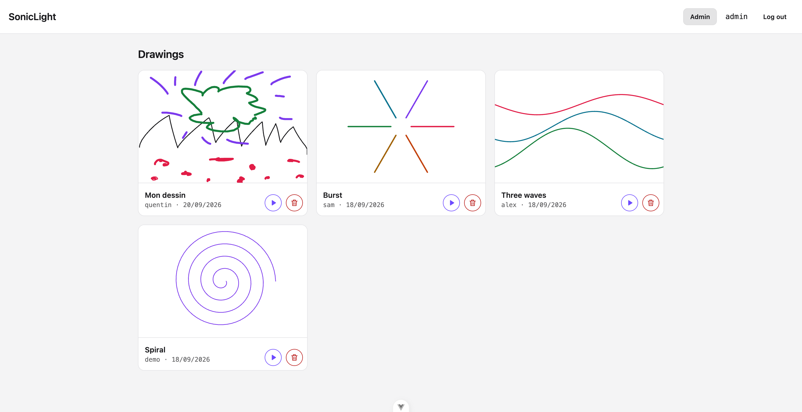
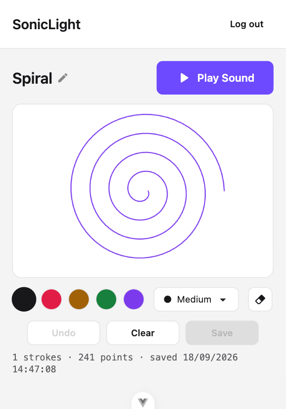
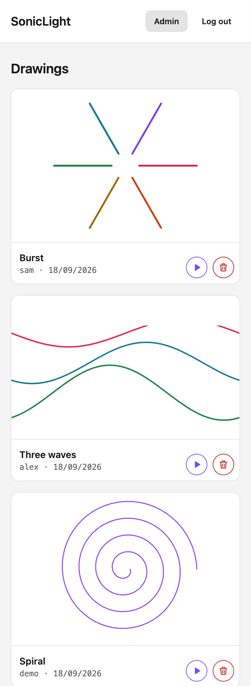

# SonicLight - Test technique Ircam


L'application permet de créer un dessin sur un canvas, de l'enregistrer et de le retrouver après connexion. Une interface d'administration permet de consulter les dessins des utilisateurs et de les supprimer.

En complément, les dessins peuvent être joués avec la Web Audio API. Le dessin est parcouru de gauche à droite et ses différentes caractéristiques sont utilisées pour générer les sons.

## Démonstration

**lien de démo :** https://sonic-light-test-technique.vercel.app/

| Compte | Mot de passe | Rôle                                   |
| ------ | ------------ | -------------------------------------- |
| `demo` | `demo1234`   | Utilisateur, avec un dessin enregistré |

l'inscription est également possible pour créer un compte utilisateur (nom d'utilisateur et mot de passe).

## Aperçu

### Desktop

|                                      Canvas utilisateur                                      |                                      Interface d'administration                                     |
| :---------------------------------------------------------------------------------------: | :-------------------------------------------------------------------------------------------------: |
|  |  |

### Mobile

|                                      Canvas utilisateur                                      |                                      Interface d'administration                                     |
| :---------------------------------------------------------------------------------------: | :-------------------------------------------------------------------------------------------------: |
|  |  |


## Fonctionnalités

| # | Exigence                            | Implémentation                                                                     |
| - | ----------------------------------- | ---------------------------------------------------------------------------------- |
| 1 | Identifier un utilisateur           | Inscription, connexion et session persistante après rechargement                   |
| 2 | Créer un dessin sur un canvas       | Souris, doigt et stylet, avec palette de couleurs, épaisseurs, gomme et annulation |
| 3 | Enregistrer et retrouver son dessin | Un dessin par utilisateur, remplacé lors d'un nouvel enregistrement                |
| 4 | Interface d'administration          | Liste de tous les dessins avec leur auteur, lecture et suppression                 |
| 5 | Lecture sonore                      | Web Audio API, avec une tête de lecture synchronisée avec le dessin                |

## Technologies

| Technologie                    | Utilisation                                             |
| ------------------------------ | ------------------------------------------------------- |
| **Vue 3**                      | Interface utilisateur et SPA                            |
| **Vite**                       | Serveur de développement et build du frontend           |
| **Pinia**                      | Gestion de l'état d'authentification                    |
| **Vue Router**                 | Navigation et protection des routes côté client         |
| **vue-i18n**                   | Interface en français et en anglais                     |
| **Tailwind CSS 4 + DaisyUI 5** | Styles et composants d'interface                        |
| **Express 5**                  | API REST                                                |
| **TypeScript**                 | Typage du frontend et du backend                        |
| **Prisma 7**                   | Accès à la base de données et migrations                |
| **PostgreSQL 16**              | Stockage des utilisateurs et des dessins                |
| **Zod**                        | Validation des données et des variables d'environnement |
| **jsonwebtoken + bcryptjs**    | Authentification                                        |
| **Vitest**                     | Tests du backend                                        |
| **Playwright**                 | Tests end-to-end, côté utilisateur et administrateur    |
| **Docker Compose**             | Lancement de PostgreSQL, de l'API et du frontend        |

Les dessins sont stockés dans PostgreSQL sous forme de `jsonb`. Ils contiennent les traits, leurs points, leurs couleurs et leurs épaisseurs. Stockés sous forme vectorielle, ils sont indépendants de la taille du canvas et peuvent être utilisés pour la lecture sonore.

## Démarrage

### Avec Docker

Pour lancer l'ensemble du projet :

```bash
docker compose up --build
```

Le frontend est alors disponible sur :

```text
http://localhost:5173
```

### Développement local

Il est également possible de lancer PostgreSQL dans Docker et les deux applications directement sur la machine.

Démarrer la base :

```bash
docker compose up -d db
```

Copier les fichiers d'environnement :

```bash
cp backend/.env.example backend/.env
cp frontend/.env.example frontend/.env
```

Renseigner notamment `JWT_SECRET` dans `backend/.env`.

Puis installer et lancer le backend :

```bash
cd backend
npm install
npm run dev
```

API :

```text
http://localhost:3000
```

Dans un deuxième terminal, installer et lancer le frontend :

```bash
cd frontend
npm install
npm run dev
```

Frontend :

```text
http://localhost:5173
```

Le frontend et le backend sont volontairement indépendants et ne sont pas organisés en workspace npm.

## Architecture

Le projet est organisé en trois paquets npm indépendants :

```text
sonic-light/
├── frontend/    # Vue 3 + Vite
├── backend/     # Express + Prisma
├── e2e/         # Tests end-to-end Playwright
├── context/     # Documentation du projet
└── docker-compose.yml
```

Le frontend communique avec l'API REST d'Express via HTTP. Les données sont échangées au format JSON.

Le serveur Express utilise Prisma pour accéder à la base PostgreSQL.

Docker Compose permet de lancer PostgreSQL, le backend et le frontend dans des conteneurs séparés.

Les coordonnées des dessins sont normalisées entre `0` et `1` plutôt que stockées en pixels. Cela permet de restituer le même dessin sur différentes tailles de canvas.

Le ratio du canvas est également enregistré avec le dessin afin de conserver ses proportions lors de sa restitution.

## Authentification

L'API utilise des JWT avec l'en-tête `Authorization: Bearer`.

Les mots de passe sont hashés avec bcrypt.

L'identité de l'utilisateur est récupérée côté serveur à partir du token. Les routes utilisateur ne prennent donc pas de `userId` fourni par le client pour accéder à un dessin.

Les routes d'administration sont protégées séparément par le contrôle du rôle administrateur.

Côté frontend, le JWT est conservé dans `localStorage` afin de maintenir la session après un rechargement de la page.

## Sonification

La lecture sonore est basée directement sur les données du dessin.

Le dessin est parcouru de gauche à droite sur une durée de huit secondes :

* `x` → position dans le temps
* `y` → hauteur de la note
* épaisseur du trait → gain
* couleur → timbre

La hauteur est quantifiée sur une gamme pentatonique mineure afin d'éviter les demi-tons adjacents et de garder des combinaisons de notes relativement consonantes.

La lecture est organisée en 64 pas et boucle à la fin du dessin.

Le mapping entre la géométrie et les événements musicaux est séparé du moteur audio. `audio/sonify.ts` produit les données nécessaires à la lecture, tandis que `WebAudioEngine` s'occupe de la partie Web Audio API.

Cela permet de faire évoluer le moteur audio sans modifier directement le mapping du dessin.

## Quelques choix techniques

### Stocker les traits plutôt qu'une image

Un dessin est enregistré comme une liste de traits et de points plutôt que comme une image PNG.

Cela permet notamment de réutiliser directement les coordonnées pour la lecture sonore et de conserver une représentation indépendante de la taille du canvas.

### Un dessin par utilisateur

Dans le cadre de l'exercice, un utilisateur possède au maximum un dessin.

Lors d'un nouvel enregistrement, le dessin précédent est remplacé.

### Validation avec Zod

Les données reçues par l'API sont validées avec Zod.

Les schémas Zod servent également de types TypeScript lorsque cela est pertinent, afin d'éviter de maintenir séparément un type et sa validation runtime.

Les variables d'environnement sont également validées au démarrage de l'application.

### Canvas

Le canvas prend en charge les interactions à la souris, au doigt et au stylet.

Les coordonnées sont converties en coordonnées normalisées afin de ne pas dépendre de la résolution du canvas.

La gomme supprime un trait complet. Une gomme basée sur des pixels ou sur une portion de trait aurait nécessité une gestion différente puisque les données sont stockées sous forme vectorielle.

## Tests

### API — Vitest

Les tests de l'API utilisent une vraie base PostgreSQL.

Initialiser la base de test une première fois :

```bash
cd backend
npm run test:db
```

Puis lancer les tests :

```bash
npm test
```

Le projet contient actuellement **64 tests**.

### End-to-end — Playwright

Ils s'exécutent contre la vraie pile — Vite, l'API et la base de développement seedée — et suivent le Page Object Model, avec des fixtures qui créent un compte jetable par l'API et suppriment son dessin à la fin du test.

| Rôle            | Ce qui est vérifié                                            |
| --------------- | ------------------------------------------------------------- |
| Utilisateur     | Un mauvais mot de passe est refusé avec un message lisible    |
| Utilisateur     | Il dessine, enregistre, recharge la page, retrouve son dessin |
| Utilisateur     | Il n'atteint pas la vue d'administration                      |
| Administrateur  | Il voit les dessins de tous les utilisateurs                  |
| Administrateur  | Il supprime le dessin d'un utilisateur après confirmation     |

La base doit être démarrée et seedée, puis :

```bash
cd e2e
npm install
npx playwright install chromium
npm test
```

Playwright réutilise l'API et le frontend s'ils tournent déjà, et les démarre lui-même sinon.

Quelques variantes utiles :

```bash
npm run test:ui                   # interface Playwright, pas à pas
npx playwright test --headed      # voir le navigateur
npx playwright test -g "reload"   # un seul test, par son nom
```

### Intégration continue

Une GitHub Action exécute les vérifications de types, les tests de l'API et le build à chaque push. Les tests end-to-end ne sont pour l'instant pas dans cette pipeline : ils demandent de démarrer les trois services sur le runner, et cet ajout n'a pas été fait.

## Hors périmètre

Les fonctionnalités suivantes ne sont pas implémentées dans le cadre de l'exercice :

* plusieurs dessins par utilisateur
* modification d'un dessin par l'administrateur
* partage public par lien
* calques
* formes géométriques
* remplissage
* texte
* export PNG/SVG
* collaboration en temps réel
* OAuth
* réinitialisation de mot de passe
* pagination
* mode hors ligne

Ces fonctionnalités pourraient être ajoutées ultérieurement.

## Limites connues

* **Pas de limitation de débit sur `/api/auth/login`** : l'endpoint pourrait être soumis à des tentatives répétées de connexion.
* **Pas de tests unitaires côté frontend** : les composants et les composables ne sont pas testés unitairement. Les tests portent sur l'API — notamment l'isolation entre utilisateurs — et sur les parcours complets avec Playwright.
* **Les tests end-to-end s'appuient sur la base de développement seedée** et ne sont pas exécutés en intégration continue. Chaque exécution y laisse un compte `e2e-<timestamp>`, sans dessin : aucune route ne permet de supprimer un compte.
* **Canvas non accessible au clavier**.
* **La gomme supprime un trait entier** plutôt qu'une partie du trait.
* **Les messages de validation restent en anglais** : ils sont rédigés par Zod côté serveur et transmis sous un seul code d'erreur, `request.invalidBody`. Les autres messages, adossés à des codes stables, sont traduits par le client.
* **Le JWT est stocké dans `localStorage`**, ce qui est simple pour une SPA mais présente des limites en cas de compromission XSS.

## Documentation

Des informations complémentaires sont disponibles dans le dossier `context/` :

* [`context/project-overview.md`](context/project-overview.md) — architecture, format des dessins, données, authentification, sonification et déploiement

* [`context/coding-standards.md`](context/coding-standards.md) — conventions utilisées dans le projet
  